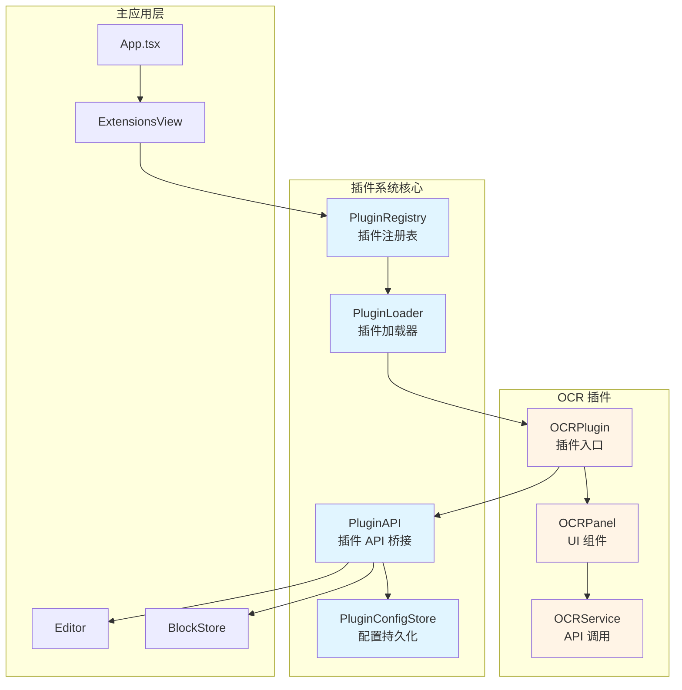
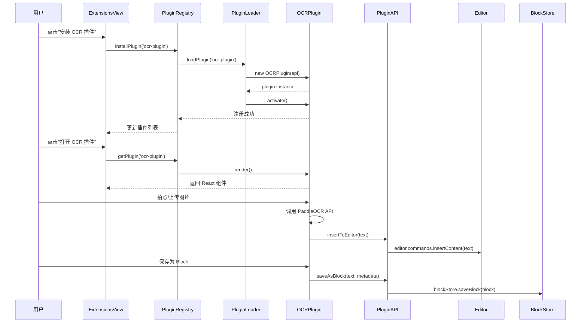
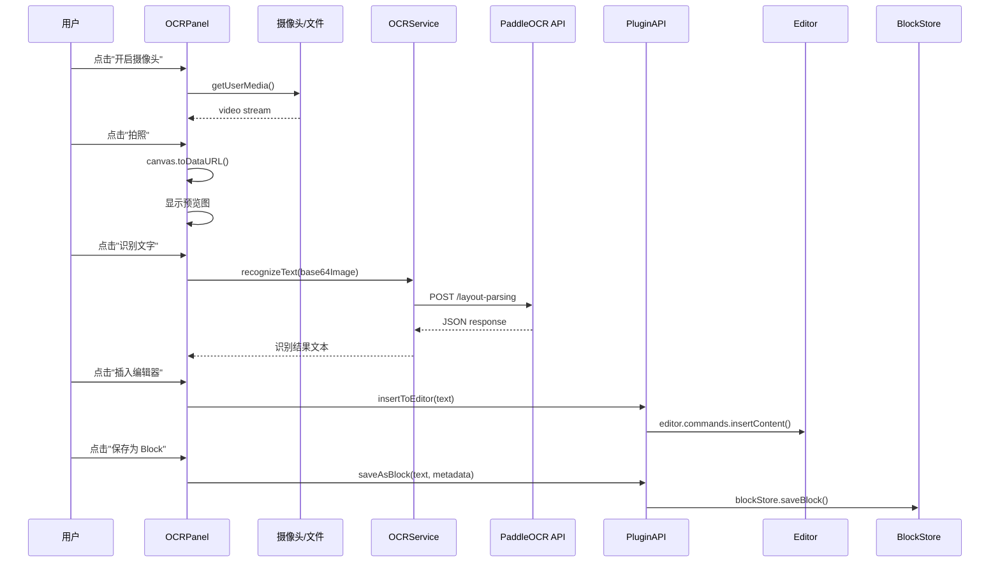

。→→→

**核心设计目标**：
- 通用插件架构：支持多种类型的插件扩展
- 完全可插拔：插件可独立安装/卸载，不影响主应用
- 权限管理：插件访问主应用功能需要明确的权限声明
- 配置持久化：插件配置（API URL、Token 等）保存到 localStorage
- 类型安全：所有插件接口使用 TypeScript 严格类型定义

## Architecture

### High-Level Architecture



### Plugin System Data Flow



### OCR Plugin Data Flow




## Components and Interfaces

### 1. Plugin System Core

#### 1.1 Plugin Interface (插件基础接口)

```typescript
// src/types/plugin.ts

/** 插件元数据 */
export interface PluginMetadata {
  id: string                    // 插件唯一标识（kebab-case）
  name: string                  // 插件显示名称
  version: string               // 语义化版本号
  description: string           // 插件描述
  author: string                // 作者
  icon?: string                 // 图标（lucide-react 图标名或 emoji）
  permissions: PluginPermission[] // 所需权限列表
}

/** 插件权限类型 */
export type PluginPermission =
  | 'editor:read'       // 读取编辑器内容
  | 'editor:write'      // 写入编辑器内容
  | 'block:read'        // 读取 Block
  | 'block:write'       // 创建/修改 Block
  | 'storage:read'      // 读取插件配置
  | 'storage:write'     // 写入插件配置
  | 'network'           // 发起网络请求

/** 插件生命周期接口 */
export interface IPlugin {
  /** 插件元数据 */
  readonly metadata: PluginMetadata
  
  /** 激活插件（安装后调用） */
  activate(): Promise<void> | void
  
  /** 停用插件（卸载前调用） */
  deactivate(): Promise<void> | void
  
  /** 渲染插件 UI（返回 React 组件） */
  render(): React.ReactElement
  
  /** 获取插件配置界面（可选） */
  renderSettings?(): React.ReactElement
}

/** 插件状态 */
export type PluginStatus = 'installed' | 'active' | 'inactive' | 'error'

/** 插件注册表条目 */
export interface PluginRegistryEntry {
  metadata: PluginMetadata
  instance: IPlugin | null
  status: PluginStatus
  error?: string
  installedAt: Date
  lastActivatedAt?: Date
}
```

#### 1.2 Plugin API (插件 API 桥接)

```typescript
// src/services/pluginAPI.ts

import type { Editor as TiptapEditor } from '@tiptap/react'
import type { Block } from '../types/block'
import type { PluginPermission } from '../types/plugin'

/** 插件 API 上下文 */
export interface PluginAPIContext {
  /** 插件 ID */
  pluginId: string
  /** 插件权限列表 */
  permissions: PluginPermission[]
}

/** 插件 API 接口 */
export interface IPluginAPI {
  // ---- 编辑器操作 ----
  
  /** 获取当前编辑器实例（需要 editor:read 权限） */
  getEditor(): TiptapEditor | null
  
  /** 在光标位置插入文本（需要 editor:write 权限） */
  insertToEditor(content: string): Promise<void>
  
  /** 在光标位置插入 SourceBlock（需要 editor:write 权限） */
  insertSourceBlock(content: string, source: 'ai' | 'inspiration' | 'import', label: string): Promise<void>
  
  /** 获取当前选中的文本（需要 editor:read 权限） */
  getSelectedText(): string | null
  
  // ---- Block 操作 ----
  
  /** 保存为显式 Block（需要 block:write 权限） */
  saveAsBlock(content: string, metadata: {
    title?: string
    tags?: string[]
    source?: { type: 'editor' | 'ai' | 'import'; documentId?: string }
  }): Promise<Block>
  
  /** 搜索 Block（需要 block:read 权限） */
  searchBlocks(query: string): Promise<Block[]>
  
  /** 获取 Block 详情（需要 block:read 权限） */
  getBlock(blockId: string): Promise<Block | null>
  
  // ---- 配置存储 ----
  
  /** 读取插件配置（需要 storage:read 权限） */
  getConfig<T = unknown>(key: string): T | null
  
  /** 保存插件配置（需要 storage:write 权限） */
  setConfig<T = unknown>(key: string, value: T): void
  
  /** 删除插件配置（需要 storage:write 权限） */
  removeConfig(key: string): void
  
  // ---- 通知 ----
  
  /** 显示成功提示 */
  showSuccess(message: string): void
  
  /** 显示错误提示 */
  showError(message: string): void
  
  /** 显示信息提示 */
  showInfo(message: string): void
}

/** 权限检查装饰器（内部使用） */
function requirePermission(permission: PluginPermission) {
  return function (target: unknown, propertyKey: string, descriptor: PropertyDescriptor) {
    const originalMethod = descriptor.value
    descriptor.value = function (this: PluginAPI, ...args: unknown[]) {
      if (!this.context.permissions.includes(permission)) {
        throw new Error(`Plugin "${this.context.pluginId}" lacks permission: ${permission}`)
      }
      return originalMethod.apply(this, args)
    }
    return descriptor
  }
}

/** 插件 API 实现类 */
export class PluginAPI implements IPluginAPI {
  constructor(
    private context: PluginAPIContext,
    private editorRef: React.MutableRefObject<TiptapEditor | null>
  ) {}
  
  @requirePermission('editor:read')
  getEditor(): TiptapEditor | null {
    return this.editorRef.current
  }
  
  @requirePermission('editor:write')
  async insertToEditor(content: string): Promise<void> {
    const editor = this.editorRef.current
    if (!editor) throw new Error('Editor not available')
    editor.chain().focus().insertContent(content).run()
  }
  
  @requirePermission('editor:write')
  async insertSourceBlock(content: string, source: 'ai' | 'inspiration' | 'import', label: string): Promise<void> {
    const editor = this.editorRef.current
    if (!editor) throw new Error('Editor not available')
    
    const lines = content.split('\n').filter(l => l.trim())
    editor.chain().focus().insertContent({
      type: 'sourceBlock',
      attrs: { source, sourceLabel: label },
      content: lines.map(line => ({
        type: 'paragraph',
        content: [{ type: 'text', text: line }],
      })),
    }).run()
  }
  
  @requirePermission('editor:read')
  getSelectedText(): string | null {
    const editor = this.editorRef.current
    if (!editor) return null
    const { from, to } = editor.state.selection
    if (from === to) return null
    return editor.state.doc.textBetween(from, to, '\n')
  }
  
  @requirePermission('block:write')
  async saveAsBlock(content: string, metadata: {
    title?: string
    tags?: string[]
    source?: { type: 'editor' | 'ai' | 'import'; documentId?: string }
  }): Promise<Block> {
    const { blockStore } = await import('../storage/blockStore')
    const { generateUUID } = await import('../utils/uuid')
    
    const block: Block = {
      id: generateUUID(),
      content,
      type: 'text',
      source: metadata.source || { type: 'import', capturedAt: new Date() },
      metadata: {
        title: metadata.title,
        tags: metadata.tags || [],
        createdAt: new Date(),
        updatedAt: new Date(),
      },
    }
    
    await blockStore.saveBlock(block)
    return block
  }
  
  @requirePermission('block:read')
  async searchBlocks(query: string): Promise<Block[]> {
    const { blockStore } = await import('../storage/blockStore')
    return blockStore.searchBlocks(query)
  }
  
  @requirePermission('block:read')
  async getBlock(blockId: string): Promise<Block | null> {
    const { blockStore } = await import('../storage/blockStore')
    return blockStore.getBlock(blockId)
  }
  
  @requirePermission('storage:read')
  getConfig<T = unknown>(key: string): T | null {
    const storageKey = `plugin:${this.context.pluginId}:${key}`
    const value = localStorage.getItem(storageKey)
    return value ? JSON.parse(value) : null
  }
  
  @requirePermission('storage:write')
  setConfig<T = unknown>(key: string, value: T): void {
    const storageKey = `plugin:${this.context.pluginId}:${key}`
    localStorage.setItem(storageKey, JSON.stringify(value))
  }
  
  @requirePermission('storage:write')
  removeConfig(key: string): void {
    const storageKey = `plugin:${this.context.pluginId}:${key}`
    localStorage.removeItem(key)
  }
  
  showSuccess(message: string): void {
    window.dispatchEvent(new CustomEvent('showToast', {
      detail: { type: 'success', message },
    }))
  }
  
  showError(message: string): void {
    window.dispatchEvent(new CustomEvent('showToast', {
      detail: { type: 'error', message },
    }))
  }
  
  showInfo(message: string): void {
    window.dispatchEvent(new CustomEvent('showToast', {
      detail: { type: 'info', message },
    }))
  }
}
```


#### 1.3 Plugin Registry (插件注册表)

```typescript
// src/services/pluginRegistry.ts

import type { IPlugin, PluginMetadata, PluginRegistryEntry, PluginStatus } from '../types/plugin'
import type { IPluginAPI } from './pluginAPI'

/** 插件注册表（单例） */
export class PluginRegistry {
  private plugins: Map<string, PluginRegistryEntry> = new Map()
  private pluginAPI: IPluginAPI | null = null
  
  /** 设置插件 API 实例 */
  setPluginAPI(api: IPluginAPI): void {
    this.pluginAPI = api
  }
  
  /** 注册插件 */
  async registerPlugin(pluginClass: new (api: IPluginAPI) => IPlugin): Promise<void> {
    if (!this.pluginAPI) {
      throw new Error('PluginAPI not initialized')
    }
    
    const instance = new pluginClass(this.pluginAPI)
    const metadata = instance.metadata
    
    if (this.plugins.has(metadata.id)) {
      throw new Error(`Plugin "${metadata.id}" is already registered`)
    }
    
    const entry: PluginRegistryEntry = {
      metadata,
      instance,
      status: 'installed',
      installedAt: new Date(),
    }
    
    this.plugins.set(metadata.id, entry)
    
    // 自动激活
    await this.activatePlugin(metadata.id)
  }
  
  /** 激活插件 */
  async activatePlugin(pluginId: string): Promise<void> {
    const entry = this.plugins.get(pluginId)
    if (!entry) throw new Error(`Plugin "${pluginId}" not found`)
    if (!entry.instance) throw new Error(`Plugin "${pluginId}" instance not available`)
    
    try {
      await entry.instance.activate()
      entry.status = 'active'
      entry.lastActivatedAt = new Date()
      entry.error = undefined
    } catch (error) {
      entry.status = 'error'
      entry.error = (error as Error).message
      throw error
    }
  }
  
  /** 停用插件 */
  async deactivatePlugin(pluginId: string): Promise<void> {
    const entry = this.plugins.get(pluginId)
    if (!entry) throw new Error(`Plugin "${pluginId}" not found`)
    if (!entry.instance) throw new Error(`Plugin "${pluginId}" instance not available`)
    
    try {
      await entry.instance.deactivate()
      entry.status = 'inactive'
    } catch (error) {
      entry.status = 'error'
      entry.error = (error as Error).message
      throw error
    }
  }
  
  /** 卸载插件 */
  async uninstallPlugin(pluginId: string): Promise<void> {
    const entry = this.plugins.get(pluginId)
    if (!entry) throw new Error(`Plugin "${pluginId}" not found`)
    
    if (entry.status === 'active') {
      await this.deactivatePlugin(pluginId)
    }
    
    // 清理插件配置
    const keys = Object.keys(localStorage)
    keys.forEach(key => {
      if (key.startsWith(`plugin:${pluginId}:`)) {
        localStorage.removeItem(key)
      }
    })
    
    this.plugins.delete(pluginId)
  }
  
  /** 获取插件实例 */
  getPlugin(pluginId: string): IPlugin | null {
    return this.plugins.get(pluginId)?.instance || null
  }
  
  /** 获取所有插件 */
  getAllPlugins(): PluginRegistryEntry[] {
    return Array.from(this.plugins.values())
  }
  
  /** 获取插件状态 */
  getPluginStatus(pluginId: string): PluginStatus | null {
    return this.plugins.get(pluginId)?.status || null
  }
}

/** 全局插件注册表实例 */
export const pluginRegistry = new PluginRegistry()
```

#### 1.4 Plugin Config Store (配置持久化)

```typescript
// src/storage/pluginConfigStore.ts

/** 插件配置存储（基于 localStorage） */
export class PluginConfigStore {
  private prefix = 'plugin:'
  
  /** 获取插件配置 */
  get<T = unknown>(pluginId: string, key: string): T | null {
    const storageKey = `${this.prefix}${pluginId}:${key}`
    const value = localStorage.getItem(storageKey)
    return value ? JSON.parse(value) : null
  }
  
  /** 保存插件配置 */
  set<T = unknown>(pluginId: string, key: string, value: T): void {
    const storageKey = `${this.prefix}${pluginId}:${key}`
    localStorage.setItem(storageKey, JSON.stringify(value))
  }
  
  /** 删除插件配置 */
  remove(pluginId: string, key: string): void {
    const storageKey = `${this.prefix}${pluginId}:${key}`
    localStorage.removeItem(storageKey)
  }
  
  /** 获取插件所有配置 */
  getAll(pluginId: string): Record<string, unknown> {
    const prefix = `${this.prefix}${pluginId}:`
    const config: Record<string, unknown> = {}
    
    Object.keys(localStorage).forEach(key => {
      if (key.startsWith(prefix)) {
        const configKey = key.slice(prefix.length)
        const value = localStorage.getItem(key)
        config[configKey] = value ? JSON.parse(value) : null
      }
    })
    
    return config
  }
  
  /** 清空插件所有配置 */
  clearAll(pluginId: string): void {
    const prefix = `${this.prefix}${pluginId}:`
    const keys = Object.keys(localStorage).filter(key => key.startsWith(prefix))
    keys.forEach(key => localStorage.removeItem(key))
  }
}

export const pluginConfigStore = new PluginConfigStore()
```


### 2. OCR Plugin Implementation

#### 2.1 OCR Plugin Entry (插件入口)

```typescript
// src/plugins/ocr-plugin/index.ts

import type { IPlugin, PluginMetadata } from '../../types/plugin'
import type { IPluginAPI } from '../../services/pluginAPI'
import { OCRPanel } from './OCRPanel'

export class OCRPlugin implements IPlugin {
  readonly metadata: PluginMetadata = {
    id: 'ocr-plugin',
    name: 'OCR 文字识别',
    version: '1.0.0',
    description: '使用 PaddleOCR 识别图片中的文字，支持摄像头拍照和图片上传',
    author: 'BlockOS Team',
    icon: 'Camera',
    permissions: [
      'editor:write',
      'block:write',
      'storage:read',
      'storage:write',
      'network',
    ],
  }
  
  constructor(private api: IPluginAPI) {}
  
  async activate(): Promise<void> {
    console.log('[OCRPlugin] Activated')
    
    // 初始化默认配置
    const apiUrl = this.api.getConfig<string>('apiUrl')
    const apiToken = this.api.getConfig<string>('apiToken')
    
    if (!apiUrl) {
      this.api.setConfig('apiUrl', 'https://lao3t2m4beyceb6c.aistudio-app.com/layout-parsing')
    }
    if (!apiToken) {
      this.api.setConfig('apiToken', '74fc1211d4321e9438158dae3d22f8005fd5e4e2')
    }
  }
  
  async deactivate(): Promise<void> {
    console.log('[OCRPlugin] Deactivated')
  }
  
  render(): React.ReactElement {
    return <OCRPanel api={this.api} />
  }
  
  renderSettings(): React.ReactElement {
    return <OCRSettingsPanel api={this.api} />
  }
}

/** OCR 设置面板 */
function OCRSettingsPanel({ api }: { api: IPluginAPI }) {
  const [apiUrl, setApiUrl] = React.useState(api.getConfig<string>('apiUrl') || '')
  const [apiToken, setApiToken] = React.useState(api.getConfig<string>('apiToken') || '')
  
  const handleSave = () => {
    api.setConfig('apiUrl', apiUrl)
    api.setConfig('apiToken', apiToken)
    api.showSuccess('配置已保存')
  }
  
  return (
    <div className="ocr-settings">
      <h3>OCR API 配置</h3>
      <div className="form-group">
        <label>API 地址</label>
        <input
          type="text"
          value={apiUrl}
          onChange={e => setApiUrl(e.target.value)}
          placeholder="https://..."
        />
      </div>
      <div className="form-group">
        <label>API Token</label>
        <input
          type="text"
          value={apiToken}
          onChange={e => setApiToken(e.target.value)}
          placeholder="输入 Token"
        />
      </div>
      <button onClick={handleSave}>保存配置</button>
    </div>
  )
}
```

#### 2.2 OCR Panel Component (UI 组件)

```typescript
// src/plugins/ocr-plugin/OCRPanel.tsx

import { useRef, useState, useCallback } from 'react'
import type { IPluginAPI } from '../../services/pluginAPI'
import { recognizeText } from './ocrService'
import './OCRPanel.css'

type OCRStatus = 'idle' | 'camera' | 'captured' | 'loading' | 'done' | 'error'

interface OCRPanelProps {
  api: IPluginAPI
}

export function OCRPanel({ api }: OCRPanelProps) {
  const videoRef = useRef<HTMLVideoElement>(null)
  const canvasRef = useRef<HTMLCanvasElement>(null)
  const streamRef = useRef<MediaStream | null>(null)
  
  const [status, setStatus] = useState<OCRStatus>('idle')
  const [previewSrc, setPreviewSrc] = useState<string>('')
  const [capturedBase64, setCapturedBase64] = useState<string>('')
  const [resultText, setResultText] = useState<string>('')
  const [errorMsg, setErrorMsg] = useState<string>('')
  
  // 开启摄像头
  const startCamera = useCallback(async () => {
    try {
      const stream = await navigator.mediaDevices.getUserMedia({
        video: { facingMode: 'environment' },
        audio: false,
      })
      streamRef.current = stream
      if (videoRef.current) videoRef.current.srcObject = stream
      setStatus('camera')
      setErrorMsg('')
    } catch (err) {
      setErrorMsg('无法访问摄像头：' + (err as Error).message)
      api.showError('无法访问摄像头')
    }
  }, [api])
  
  // 拍照
  const capture = useCallback(() => {
    const video = videoRef.current
    const canvas = canvasRef.current
    if (!video || !canvas) return
    
    canvas.width = video.videoWidth || 640
    canvas.height = video.videoHeight || 480
    canvas.getContext('2d')!.drawImage(video, 0, 0)
    
    const dataUrl = canvas.toDataURL('image/jpeg', 0.9)
    const base64 = dataUrl.split(',')[1]
    
    setCapturedBase64(base64)
    setPreviewSrc(dataUrl)
    setStatus('captured')
    
    // 停止摄像头
    streamRef.current?.getTracks().forEach(t => t.stop())
    streamRef.current = null
  }, [])
  
  // 上传图片
  const onFileChange = useCallback((e: React.ChangeEvent<HTMLInputElement>) => {
    const file = e.target.files?.[0]
    if (!file) return
    
    const reader = new FileReader()
    reader.onload = (ev) => {
      const dataUrl = ev.target!.result as string
      setCapturedBase64(dataUrl.split(',')[1])
      setPreviewSrc(dataUrl)
      setStatus('captured')
      setErrorMsg('')
    }
    reader.readAsDataURL(file)
  }, [])
  
  // 识别文字
  const runOCR = useCallback(async () => {
    if (!capturedBase64) return
    
    setStatus('loading')
    setErrorMsg('')
    setResultText('')
    
    try {
      const apiUrl = api.getConfig<string>('apiUrl') || ''
      const apiToken = api.getConfig<string>('apiToken') || ''
      
      if (!apiUrl || !apiToken) {
        throw new Error('请先配置 API 地址和 Token')
      }
      
      const text = await recognizeText(capturedBase64, apiUrl, apiToken)
      setResultText(text)
      setStatus('done')
      api.showSuccess('识别成功')
    } catch (err) {
      setErrorMsg((err as Error).message)
      setStatus('error')
      api.showError('识别失败：' + (err as Error).message)
    }
  }, [capturedBase64, api])
  
  // 插入编辑器
  const insertToEditor = useCallback(async () => {
    if (!resultText) return
    
    try {
      await api.insertSourceBlock(resultText, 'import', '📷 OCR 识别')
      api.showSuccess('已插入编辑器')
    } catch (err) {
      api.showError('插入失败：' + (err as Error).message)
    }
  }, [resultText, api])
  
  // 保存为 Block
  const saveAsBlock = useCallback(async () => {
    if (!resultText) return
    
    try {
      await api.saveAsBlock(resultText, {
        title: 'OCR 识别结果',
        tags: ['OCR', '图片识别'],
        source: { type: 'import' },
      })
      api.showSuccess('已保存为 Block')
    } catch (err) {
      api.showError('保存失败：' + (err as Error).message)
    }
  }, [resultText, api])
  
  // 重置
  const reset = useCallback(() => {
    streamRef.current?.getTracks().forEach(t => t.stop())
    streamRef.current = null
    setCapturedBase64('')
    setPreviewSrc('')
    setResultText('')
    setErrorMsg('')
    setStatus('idle')
  }, [])
  
  return (
    <div className="ocr-panel">
      <h3>OCR 文字识别</h3>
      
      {/* 摄像头/预览区域 */}
      <div className="ocr-preview">
        {status === 'camera' && (
          <video ref={videoRef} autoPlay playsInline muted className="ocr-video" />
        )}
        {previewSrc && status !== 'camera' && (
          
        )}
        {status === 'idle' && (
          <div className="ocr-placeholder">
            点击下方按钮开始
          </div>
        )}
        <canvas ref={canvasRef} style={{ display: 'none' }} />
      </div>
      
      {/* 操作按钮 */}
      <div className="ocr-actions">
        {status === 'idle' && (
          <>
            <button onClick={startCamera}>开启摄像头</button>
            <label className="file-upload-btn">
              上传图片
              <input type="file" accept="image/*" onChange={onFileChange} style={{ display: 'none' }} />
            </label>
          </>
        )}
        {status === 'camera' && (
          <button onClick={capture}>拍照</button>
        )}
        {(status === 'captured' || status === 'done' || status === 'error') && (
          <>
            <button onClick={runOCR} disabled={status === 'loading'}>
              {status === 'loading' ? '识别中...' : '识别文字'}
            </button>
            <button onClick={reset}>重置</button>
          </>
        )}
      </div>
      
      {errorMsg && <div className="ocr-error">{errorMsg}</div>}
      
      {/* 识别结果 */}
      {resultText && (
        <div className="ocr-result">
          <h4>识别结果</h4>
          <pre className="ocr-result-text">{resultText}</pre>
          <div className="ocr-result-actions">
            <button onClick={insertToEditor}>插入编辑器</button>
            <button onClick={saveAsBlock}>保存为 Block</button>
          </div>
        </div>
      )}
    </div>
  )
}
```


#### 2.3 OCR Service (API 调用)

```typescript
// src/plugins/ocr-plugin/ocrService.ts

/** PaddleOCR API 请求参数 */
interface OCRRequest {
  file: string                      // Base64 编码的图片
  fileType: number                  // 1 = 图片, 0 = PDF
  useDocOrientationClassify: boolean
  useDocUnwarping: boolean
  useChartRecognition: boolean
}

/** PaddleOCR API 响应 */
interface OCRResponse {
  result: {
    layoutParsingResults: Array<{
      markdown: {
        text: string
      }
    }>
  }
}

/** 调用 PaddleOCR API 识别文字 */
export async function recognizeText(
  base64Image: string,
  apiUrl: string,
  apiToken: string
): Promise<string> {
  const payload: OCRRequest = {
    file: base64Image,
    fileType: 1,
    useDocOrientationClassify: false,
    useDocUnwarping: false,
    useChartRecognition: false,
  }
  
  const response = await fetch(apiUrl, {
    method: 'POST',
    headers: {
      'Content-Type': 'application/json',
      'Authorization': `token ${apiToken}`,
    },
    body: JSON.stringify(payload),
  })
  
  if (!response.ok) {
    throw new Error(`HTTP ${response.status} ${response.statusText}`)
  }
  
  const data: OCRResponse = await response.json()
  const results = data?.result?.layoutParsingResults || []
  const texts = results.map(r => r?.markdown?.text || '').filter(Boolean)
  
  if (texts.length === 0) {
    return '（未识别到文字内容）'
  }
  
  return texts.join('\n\n---\n\n')
}
```

#### 2.4 OCR Panel Styles

```css
/* src/plugins/ocr-plugin/OCRPanel.css */

.ocr-panel {
  padding: 1rem;
  display: flex;
  flex-direction: column;
  gap: 1rem;
  height: 100%;
  overflow-y: auto;
}

.ocr-panel h3 {
  font-size: 16px;
  font-weight: 500;
  margin: 0;
}

.ocr-preview {
  width: 100%;
  min-height: 200px;
  background: var(--color-background-secondary);
  border-radius: var(--border-radius-md, 8px);
  overflow: hidden;
  display: flex;
  align-items: center;
  justify-content: center;
}

.ocr-video,
.ocr-image {
  width: 100%;
  max-height: 300px;
  object-fit: contain;
  display: block;
}

.ocr-placeholder {
  color: var(--color-text-secondary);
  font-size: 14px;
  text-align: center;
  padding: 2rem;
}

.ocr-actions {
  display: flex;
  gap: 8px;
  flex-wrap: wrap;
}

.ocr-actions button,
.file-upload-btn {
  padding: 8px 16px;
  border-radius: var(--border-radius-md, 8px);
  border: 0.5px solid var(--color-border-secondary);
  background: var(--color-background-primary);
  color: var(--color-text-primary);
  font-size: 14px;
  cursor: pointer;
  transition: background 0.15s;
}

.ocr-actions button:hover,
.file-upload-btn:hover {
  background: var(--color-background-secondary);
}

.ocr-actions button:disabled {
  opacity: 0.4;
  cursor: not-allowed;
}

.ocr-error {
  color: var(--color-text-danger);
  font-size: 13px;
  padding: 8px;
  background: var(--color-background-danger);
  border-radius: var(--border-radius-md, 8px);
}

.ocr-result {
  display: flex;
  flex-direction: column;
  gap: 8px;
}

.ocr-result h4 {
  font-size: 14px;
  font-weight: 500;
  margin: 0;
}

.ocr-result-text {
  white-space: pre-wrap;
  font-size: 14px;
  line-height: 1.7;
  background: var(--color-background-secondary);
  border-radius: var(--border-radius-md, 8px);
  padding: 12px;
  max-height: 300px;
  overflow-y: auto;
  margin: 0;
}

.ocr-result-actions {
  display: flex;
  gap: 8px;
}

.ocr-result-actions button {
  padding: 8px 16px;
  border-radius: var(--border-radius-md, 8px);
  border: 0.5px solid var(--color-border-secondary);
  background: var(--color-background-info);
  color: var(--color-text-info);
  font-size: 14px;
  cursor: pointer;
  transition: opacity 0.15s;
}

.ocr-result-actions button:hover {
  opacity: 0.85;
}
```


### 3. ExtensionsView Integration

#### 3.1 Updated ExtensionsView Component

```typescript
// src/components/layout/ExtensionsView.tsx

import { useState, useEffect } from 'react'
import { Puzzle, Settings, Trash2 } from 'lucide-react'
import { pluginRegistry } from '../../services/pluginRegistry'
import type { PluginRegistryEntry } from '../../types/plugin'
import './ExtensionsView.css'

export function ExtensionsView() {
  const [plugins, setPlugins] = useState<PluginRegistryEntry[]>([])
  const [activePluginId, setActivePluginId] = useState<string | null>(null)
  const [showSettings, setShowSettings] = useState(false)
  
  useEffect(() => {
    // 加载已安装的插件列表
    setPlugins(pluginRegistry.getAllPlugins())
  }, [])
  
  const handleUninstall = async (pluginId: string) => {
    if (!confirm('确定要卸载此插件吗？')) return
    
    try {
      await pluginRegistry.uninstallPlugin(pluginId)
      setPlugins(pluginRegistry.getAllPlugins())
      if (activePluginId === pluginId) {
        setActivePluginId(null)
      }
    } catch (err) {
      alert('卸载失败：' + (err as Error).message)
    }
  }
  
  const handleOpenPlugin = (pluginId: string) => {
    setActivePluginId(pluginId)
    setShowSettings(false)
  }
  
  const handleOpenSettings = (pluginId: string) => {
    setActivePluginId(pluginId)
    setShowSettings(true)
  }
  
  const activePlugin = activePluginId ? pluginRegistry.getPlugin(activePluginId) : null
  
  return (
    <div className="extensions-view">
      {!activePluginId && (
        <>
          <div className="extensions-header">
            <h3>已安装的插件</h3>
          </div>
          
          {plugins.length === 0 ? (
            <div className="extensions-placeholder">
              <Puzzle size={48} className="extensions-icon" />
              <div className="extensions-title">暂无插件</div>
              <div className="extensions-hint">插件将在此处显示</div>
            </div>
          ) : (
            <div className="extensions-list">
              {plugins.map(entry => (
                <div key={entry.metadata.id} className="extension-item">
                  <div className="extension-icon">
                    {entry.metadata.icon || '🧩'}
                  </div>
                  <div className="extension-info">
                    <div className="extension-name">{entry.metadata.name}</div>
                    <div className="extension-desc">{entry.metadata.description}</div>
                    <div className="extension-meta">
                      v{entry.metadata.version} · {entry.metadata.author}
                    </div>
                  </div>
                  <div className="extension-actions">
                    <button
                      className="extension-btn"
                      onClick={() => handleOpenPlugin(entry.metadata.id)}
                      title="打开插件"
                    >
                      打开
                    </button>
                    <button
                      className="extension-btn extension-btn-icon"
                      onClick={() => handleOpenSettings(entry.metadata.id)}
                      title="设置"
                    >
                      <Settings size={16} />
                    </button>
                    <button
                      className="extension-btn extension-btn-icon extension-btn-danger"
                      onClick={() => handleUninstall(entry.metadata.id)}
                      title="卸载"
                    >
                      <Trash2 size={16} />
                    </button>
                  </div>
                </div>
              ))}
            </div>
          )}
        </>
      )}
      
      {activePluginId && activePlugin && (
        <div className="plugin-container">
          <div className="plugin-header">
            <button
              className="plugin-back-btn"
              onClick={() => setActivePluginId(null)}
            >
              ← 返回
            </button>
            <span className="plugin-title">
              {showSettings ? '插件设置' : activePlugin.metadata.name}
            </span>
          </div>
          <div className="plugin-content">
            {showSettings
              ? activePlugin.renderSettings?.() || <div>此插件无设置项</div>
              : activePlugin.render()}
          </div>
        </div>
      )}
    </div>
  )
}
```

#### 3.2 ExtensionsView Styles

```css
/* src/components/layout/ExtensionsView.css */

.extensions-view {
  display: flex;
  flex-direction: column;
  height: 100%;
  overflow: hidden;
}

.extensions-header {
  padding: 1rem;
  border-bottom: 0.5px solid var(--color-border-tertiary);
}

.extensions-header h3 {
  font-size: 14px;
  font-weight: 500;
  margin: 0;
  color: var(--color-text-secondary);
}

.extensions-placeholder {
  display: flex;
  flex-direction: column;
  align-items: center;
  justify-content: center;
  padding: 3rem 1rem;
  text-align: center;
  color: var(--color-text-secondary);
}

.extensions-icon {
  color: var(--color-text-tertiary);
  margin-bottom: 1rem;
}

.extensions-title {
  font-size: 16px;
  font-weight: 500;
  margin-bottom: 0.5rem;
}

.extensions-hint {
  font-size: 13px;
  color: var(--color-text-tertiary);
}

.extensions-desc {
  font-size: 12px;
  color: var(--color-text-tertiary);
  margin-top: 0.5rem;
}

.extensions-list {
  display: flex;
  flex-direction: column;
  gap: 8px;
  padding: 1rem;
  overflow-y: auto;
}

.extension-item {
  display: flex;
  align-items: flex-start;
  gap: 12px;
  padding: 12px;
  background: var(--color-background-primary);
  border: 0.5px solid var(--color-border-tertiary);
  border-radius: var(--border-radius-md, 8px);
  transition: background 0.15s;
}

.extension-item:hover {
  background: var(--color-background-secondary);
}

.extension-icon {
  font-size: 24px;
  width: 40px;
  height: 40px;
  display: flex;
  align-items: center;
  justify-content: center;
  background: var(--color-background-secondary);
  border-radius: var(--border-radius-md, 8px);
  flex-shrink: 0;
}

.extension-info {
  flex: 1;
  min-width: 0;
}

.extension-name {
  font-size: 14px;
  font-weight: 500;
  color: var(--color-text-primary);
  margin-bottom: 4px;
}

.extension-desc {
  font-size: 12px;
  color: var(--color-text-secondary);
  line-height: 1.4;
  margin-bottom: 4px;
}

.extension-meta {
  font-size: 11px;
  color: var(--color-text-tertiary);
}

.extension-actions {
  display: flex;
  gap: 4px;
  flex-shrink: 0;
}

.extension-btn {
  padding: 6px 12px;
  border-radius: var(--border-radius-sm, 6px);
  border: 0.5px solid var(--color-border-secondary);
  background: var(--color-background-primary);
  color: var(--color-text-primary);
  font-size: 12px;
  cursor: pointer;
  transition: background 0.15s;
}

.extension-btn:hover {
  background: var(--color-background-secondary);
}

.extension-btn-icon {
  padding: 6px;
  display: flex;
  align-items: center;
  justify-content: center;
}

.extension-btn-danger {
  color: var(--color-text-danger);
}

.extension-btn-danger:hover {
  background: var(--color-background-danger);
}

.plugin-container {
  display: flex;
  flex-direction: column;
  height: 100%;
  overflow: hidden;
}

.plugin-header {
  display: flex;
  align-items: center;
  gap: 12px;
  padding: 1rem;
  border-bottom: 0.5px solid var(--color-border-tertiary);
}

.plugin-back-btn {
  padding: 4px 8px;
  border-radius: var(--border-radius-sm, 6px);
  border: 0.5px solid var(--color-border-secondary);
  background: var(--color-background-primary);
  color: var(--color-text-primary);
  font-size: 13px;
  cursor: pointer;
  transition: background 0.15s;
}

.plugin-back-btn:hover {
  background: var(--color-background-secondary);
}

.plugin-title {
  font-size: 14px;
  font-weight: 500;
  color: var(--color-text-primary);
}

.plugin-content {
  flex: 1;
  overflow-y: auto;
}
```


## Data Models

### Plugin Configuration Schema

```typescript
// localStorage 中的插件配置结构

// 插件安装列表
interface InstalledPlugins {
  plugins: string[]  // 已安装的插件 ID 列表
}
// Key: 'blockos:installed-plugins'

// 单个插件的配置
interface PluginConfig {
  [key: string]: unknown  // 插件自定义配置项
}
// Key: 'plugin:{pluginId}:{configKey}'

// OCR 插件配置示例
interface OCRPluginConfig {
  apiUrl: string      // PaddleOCR API 地址
  apiToken: string    // API Token
}
// Keys:
// - 'plugin:ocr-plugin:apiUrl'
// - 'plugin:ocr-plugin:apiToken'
```

### Plugin Registry State

```typescript
// 插件注册表内存状态

interface PluginRegistryState {
  plugins: Map<string, PluginRegistryEntry>
  pluginAPI: IPluginAPI | null
}

interface PluginRegistryEntry {
  metadata: PluginMetadata
  instance: IPlugin | null
  status: 'installed' | 'active' | 'inactive' | 'error'
  error?: string
  installedAt: Date
  lastActivatedAt?: Date
}
```

## Error Handling

### Plugin Loading Errors

```typescript
// 插件加载失败的错误处理

try {
  await pluginRegistry.registerPlugin(OCRPlugin)
} catch (error) {
  if (error instanceof PluginPermissionError) {
    // 权限不足
    showError('插件权限不足：' + error.message)
  } else if (error instanceof PluginActivationError) {
    // 激活失败
    showError('插件激活失败：' + error.message)
  } else {
    // 其他错误
    showError('插件加载失败：' + error.message)
  }
}
```

### OCR API Errors

```typescript
// OCR API 调用失败的错误处理

try {
  const text = await recognizeText(base64Image, apiUrl, apiToken)
} catch (error) {
  if (error instanceof NetworkError) {
    // 网络错误
    showError('网络连接失败，请检查网络设置')
  } else if (error instanceof APIError) {
    // API 错误
    showError('OCR API 调用失败：' + error.message)
  } else if (error instanceof AuthError) {
    // 认证错误
    showError('API Token 无效，请检查配置')
  } else {
    // 其他错误
    showError('识别失败：' + error.message)
  }
}
```

### Permission Errors

```typescript
// 插件权限检查失败的错误处理

class PluginPermissionError extends Error {
  constructor(pluginId: string, permission: PluginPermission) {
    super(`Plugin "${pluginId}" lacks permission: ${permission}`)
    this.name = 'PluginPermissionError'
  }
}

// 使用示例
try {
  await api.insertToEditor(text)
} catch (error) {
  if (error instanceof PluginPermissionError) {
    showError('插件缺少编辑器写入权限')
  }
}
```

## Testing Strategy

### Unit Testing

**Plugin Registry Tests**:
- 测试插件注册、激活、停用、卸载流程
- 测试插件状态管理
- 测试插件配置持久化

**Plugin API Tests**:
- 测试权限检查机制
- 测试编辑器操作（insertToEditor, insertSourceBlock）
- 测试 Block 操作（saveAsBlock, searchBlocks）
- 测试配置存储（getConfig, setConfig）

**OCR Service Tests**:
- 测试 PaddleOCR API 调用
- 测试 Base64 图片编码
- 测试响应解析
- 测试错误处理

### Integration Testing

**Plugin Installation Flow**:
1. 注册插件 → 验证插件出现在列表中
2. 激活插件 → 验证插件状态为 'active'
3. 打开插件 → 验证 UI 正确渲染
4. 卸载插件 → 验证插件从列表中移除

**OCR Workflow**:
1. 上传图片 → 验证预览显示
2. 调用 OCR API → 验证识别结果
3. 插入编辑器 → 验证 SourceBlock 正确插入
4. 保存为 Block → 验证 Block 正确保存到 BlockStore

**Permission Enforcement**:
1. 创建无权限的插件 → 验证操作被拒绝
2. 创建有权限的插件 → 验证操作成功

### Manual Testing Checklist

- [ ] 插件列表正确显示已安装的插件
- [ ] 点击"打开"按钮能正确打开插件 UI
- [ ] 点击"设置"按钮能打开插件配置界面
- [ ] 点击"卸载"按钮能正确卸载插件
- [ ] OCR 插件能正常开启摄像头
- [ ] OCR 插件能正常拍照并显示预览
- [ ] OCR 插件能正常上传图片
- [ ] OCR 插件能正确调用 PaddleOCR API
- [ ] OCR 识别结果能正确插入编辑器
- [ ] OCR 识别结果能正确保存为 Block
- [ ] 插件配置能正确持久化到 localStorage
- [ ] 卸载插件后配置被正确清理

## Performance Considerations

### Plugin Loading

- **懒加载**：插件只在用户打开时才加载和渲染
- **代码分割**：每个插件作为独立的 chunk，按需加载
- **缓存策略**：插件实例在注册表中缓存，避免重复创建

### OCR Processing

- **图片压缩**：拍照时使用 0.9 的 JPEG 质量，减少传输大小
- **异步处理**：OCR API 调用使用 async/await，不阻塞 UI
- **取消机制**：支持取消正在进行的 OCR 请求（使用 AbortController）

### Memory Management

- **摄像头释放**：拍照后立即停止摄像头流，释放资源
- **Base64 清理**：识别完成后清理 Base64 数据，避免内存泄漏
- **插件卸载**：卸载插件时清理所有相关资源和配置

## Security Considerations

### Permission System

- **最小权限原则**：插件只声明必需的权限
- **权限检查**：每个 API 调用前检查插件权限
- **权限提示**：安装插件时向用户展示所需权限列表

### API Security

- **Token 保护**：API Token 存储在 localStorage，不暴露在代码中
- **HTTPS Only**：强制使用 HTTPS 协议调用外部 API
- **输入验证**：验证用户输入的 API URL 和 Token 格式

### Data Privacy

- **本地处理**：图片数据仅发送到用户配置的 OCR API
- **无日志**：插件不记录用户的图片或识别结果
- **配置隔离**：每个插件的配置独立存储，互不干扰

### XSS Prevention

- **内容转义**：OCR 识别结果插入编辑器前进行转义
- **CSP 策略**：使用 Content Security Policy 防止恶意脚本注入
- **React 安全**：使用 React 的安全 API（避免 dangerouslySetInnerHTML）

## Dependencies

### Core Dependencies

- **React 18**：UI 组件框架
- **TypeScript 5**：类型系统
- **TipTap 2**：编辑器扩展（用于插入内容）

### OCR Plugin Dependencies

- **无额外依赖**：OCR 插件使用原生 Fetch API 和 Canvas API

### Browser APIs

- **MediaDevices API**：摄像头访问（`navigator.mediaDevices.getUserMedia`）
- **Canvas API**：图片处理和 Base64 编码
- **File API**：图片上传（`FileReader`）
- **LocalStorage API**：配置持久化

## File Structure

```
src/
├── types/
│   └── plugin.ts                    # 插件类型定义
├── services/
│   ├── pluginAPI.ts                 # 插件 API 实现
│   └── pluginRegistry.ts            # 插件注册表
├── storage/
│   └── pluginConfigStore.ts         # 插件配置存储
├── plugins/
│   └── ocr-plugin/
│       ├── index.ts                 # OCR 插件入口
│       ├── OCRPanel.tsx             # OCR UI 组件
│       ├── OCRPanel.css             # OCR 样式
│       └── ocrService.ts            # OCR API 调用
└── components/
    └── layout/
        ├── ExtensionsView.tsx       # 插件视图（更新）
        └── ExtensionsView.css       # 插件视图样式（更新）
```

## Migration Path

### Phase 1: Plugin System Core (Week 1)

1. 创建插件类型定义（`src/types/plugin.ts`）
2. 实现插件 API（`src/services/pluginAPI.ts`）
3. 实现插件注册表（`src/services/pluginRegistry.ts`）
4. 实现插件配置存储（`src/storage/pluginConfigStore.ts`）
5. 更新 ExtensionsView 组件

### Phase 2: OCR Plugin Implementation (Week 2)

1. 创建 OCR 插件目录结构
2. 实现 OCR 服务（`ocrService.ts`）
3. 实现 OCR UI 组件（`OCRPanel.tsx`）
4. 实现 OCR 插件入口（`index.ts`）
5. 添加 OCR 样式（`OCRPanel.css`）

### Phase 3: Integration & Testing (Week 3)

1. 在 App.tsx 中初始化插件系统
2. 注册 OCR 插件
3. 编写单元测试
4. 编写集成测试
5. 手动测试完整流程

### Phase 4: Documentation & Polish (Week 4)

1. 编写插件开发文档
2. 编写用户使用文档
3. 优化 UI/UX
4. 性能优化
5. 安全审计

## Future Extensions

### Plugin Marketplace

- 在线插件市场，支持浏览和安装第三方插件
- 插件评分和评论系统
- 插件自动更新机制

### More Plugin Types

- **翻译插件**：集成 DeepL、Google Translate 等翻译服务
- **图表生成插件**：使用 Mermaid、D3.js 生成图表
- **代码格式化插件**：集成 Prettier、ESLint 等工具
- **AI 写作助手插件**：集成更多 AI 模型（GPT-4、Claude 等）
- **Markdown 导出插件**：支持导出为 PDF、DOCX、HTML 等格式

### Plugin SDK

- 提供插件开发脚手架（CLI 工具）
- 提供插件调试工具
- 提供插件打包和发布工具

### Advanced Features

- **插件间通信**：允许插件之间相互调用
- **插件热重载**：开发时支持插件热重载
- **插件沙箱**：使用 Web Worker 或 iframe 隔离插件运行环境
- **插件权限管理 UI**：用户可以动态授予/撤销插件权限

